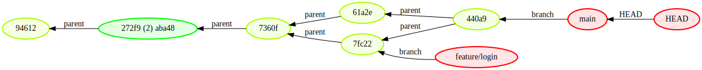
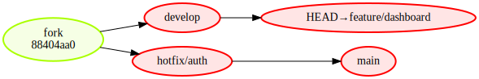
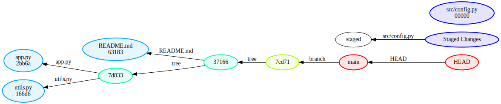

# visigit

**visigit** turns any git repository into a live Graphviz diagram. Whether you're learning why `git reset --hard` wipes your work, exploring a tangled branch topology, or teaching someone how git actually stores files as a tree of objects — visigit shows you what's happening inside the repo.

---

## Contents

- [Requirements](#requirements)
- [Installation](#installation)
- [Quick Start](#quick-start)
- [Display Modes](#display-modes)
  - [Normal mode](#normal-mode-the-default)
  - [Branch mode](#branch-mode)
  - [Verbose mode](#verbose-mode)
- [Monitor Mode — Live View](#monitor-mode--live-view)
  - [Learning git commands](#walkthrough-1-learning-git-commands)
  - [Exploring git internals](#walkthrough-2-exploring-git-internals)
- [All Options](#all-options)
- [Development](#development)

---

## Requirements

- Python 3.9+
- [Graphviz](https://graphviz.org/download/) system package (`dot` binary on PATH)

Install Graphviz:
```bash
# Ubuntu / Debian / WSL2
sudo apt install graphviz

# macOS
brew install graphviz
```

---

## Installation

```bash
git clone https://github.com/rcronk/visigit.git
cd visigit
pip install -e .
```

This installs the `visigit` command globally in your Python environment.

---

## Quick Start

```bash
# Snapshot of the current directory's repo
visigit

# Pick a specific repo
visigit --repo-path /path/to/some/repo

# Open a specific mode
visigit --mode branch
visigit --mode verbose

# Watch for changes and re-render automatically
visigit --monitor
```

By default visigit writes `visigit.svg` and opens it in an auto-refreshing browser page. Use `--no-open` to skip opening the viewer, or `--output-path` to write to a different location.

> **WSL2 users:** The default `--viewer html` opens a browser page that polls the SVG file every second. This works without `xdg-open`. If you use Windows-side Chrome or Edge, the file path will be something like `\\wsl$\Ubuntu\tmp\visigit.html`.

---

## Display Modes

### Normal mode (the default)

Shows the commit DAG with refs (branches, tags, HEAD) attached to their commits. Long chains of "boring" commits — single parent, single child, no refs — are automatically collapsed into a `LAST (N) FIRST` summary node so the graph stays readable.

```bash
visigit --mode normal
```



**What you see:**
- `HEAD` → current branch → commit chain
- Branch and tag labels next to the commits they point to
- Merge commits with edges to both parents
- Collapsed boring chains as summary nodes (e.g. `a1b2c3 (3) f4e5d6`)
- Special ref nodes: `FETCH_HEAD`, `ORIG_HEAD`, `MERGE_HEAD`, `CHERRY_PICK_HEAD`, `BISECT_HEAD`, `stash@{N}` — each appears automatically when present in the repo
- `--commit-details` adds author, message, and date to each commit node

---

### Branch mode

Shows only branch names and their topological relationships — who branched from whom. Each node is a branch tip; edges show ancestry or fork points. Use this to understand the shape of a multi-branch project at a glance.

```bash
visigit --mode branch
```



**What you see:**
- One node per branch (and tag, if any)
- Direct edge when one branch's tip is a strict ancestor of another's tip
- A `fork / <sha>` commit node when two branches have diverged from a shared ancestor (the fork commit itself is shown so you know exactly where they split)
- `HEAD→branchname` label on the currently checked-out branch
- `[wt: path]` annotation on any branch checked out in a linked worktree (`git worktree add`)

---

### Verbose mode

Shows the full git object model: commits, trees (directories), blobs (files), and the index (staged/unstaged/untracked files). Use this to understand how git actually stores your project — every `git add` and `git commit` becomes visible as a new object in the graph.

```bash
visigit --mode verbose
```



**What you see:**
- Commit → tree (root directory) → subtrees (subdirectories) → blobs (files)
- **Staged Changes** box: files in the index not yet committed, each with their blob SHA
- **Unstaged Changes** box: modified tracked files not yet staged
- **Untracked** box: files git doesn't know about yet
- `gitlink` nodes for git submodule entries (mode-160000 tree entries pointing into a submodule's history)
- New nodes added since the last render are highlighted in gold (useful in monitor mode)

---

### Mermaid output

To export a [Mermaid](https://mermaid.js.org/) flowchart instead of a Graphviz image, use `--output-format mermaid`. The output is a `.md` file you can paste directly into GitHub, GitLab, or Notion:

```bash
visigit --output-format mermaid --output-path diagram.md
```

All three display modes work with Mermaid output. The file is a fenced ` ```mermaid ``` ` block — open it in any Mermaid-aware renderer.

---

## Monitor Mode — Live View

Add `--monitor` to any mode and visigit watches the repository for filesystem changes. Every time you run a git command in another terminal, the graph re-renders automatically. New nodes since the last render are highlighted in gold.

```bash
visigit --monitor --viewer html
```

Open a second terminal window alongside the browser. Run git commands there; watch the diagram update.

---

### Walkthrough 1: Learning git commands

This walkthrough covers the git commands that confuse people most — `branch`, `merge`, `reset`, and `rebase` — and lets you watch exactly what happens to the commit graph with each one.

**Terminal A — start visigit:**
```bash
mkdir /tmp/git-lab && cd /tmp/git-lab
git init -b main
git config user.email "you@example.com"
git config user.name "Your Name"
visigit --monitor --viewer html --repo-path /tmp/git-lab
```

**Terminal B — run commands and watch the graph:**

```bash
cd /tmp/git-lab

# ── Commits ──────────────────────────────────────────────────────────────────
echo "base" > base.txt && git add -A && git commit -m "base commit"
# Graph: HEAD → main → first commit node

echo "second" > second.txt && git add -A && git commit -m "second commit"
# Graph: HEAD → main → second → base (parent chain grows)

# ── Branching ────────────────────────────────────────────────────────────────
git checkout -b feature
# Graph: 'feature' label appears on the same commit as main

echo "feat" > feat.txt && git add -A && git commit -m "add feature"
# Graph: feature moves ahead; main stays behind — you can see them diverge

git checkout main
echo "hotfix" > fix.txt && git add -A && git commit -m "hotfix"
# Graph: now main and feature have diverged from the same parent

# ── Merge: no-fast-forward ────────────────────────────────────────────────────
git merge feature --no-ff -m "Merge feature into main"
# Graph: a merge commit appears with TWO parent edges — one to each diverged tip

# ── Reset ────────────────────────────────────────────────────────────────────
git reset --soft HEAD~1
# --soft: branch pointer moves back one commit; the merge commit disappears.
# Working tree and index are unchanged.

git reset --mixed HEAD~1
# --mixed (the default): branch pointer moves back one more; staged changes clear.
# Working tree files are unchanged; you'd need to re-add them.

git reset --hard HEAD~1
# --hard: branch pointer moves back; index AND working tree are wiped to match.
# The commits are still in the object store but no longer reachable.

# ── Rebase ───────────────────────────────────────────────────────────────────
git checkout feature
git rebase main
# Graph: feature's commits are REPLAYED on top of main's current tip.
# Notice: the old feature commit nodes disappear and NEW nodes appear with
# different SHAs — rebase creates new commit objects, it doesn't move old ones.
```

---

### Walkthrough 2: Exploring git internals

This walkthrough uses verbose mode to reveal git's object model — how every file you stage and commit becomes a blob, tree, and commit object with a content-addressable SHA.

**Terminal A — start visigit in verbose mode:**
```bash
mkdir /tmp/learn-git && cd /tmp/learn-git
git init -b main
git config user.email "you@example.com"
git config user.name "Your Name"
visigit --mode verbose --monitor --viewer html --repo-path /tmp/learn-git
```

**Terminal B — run commands and watch the object graph:**

```bash
cd /tmp/learn-git

# ── Staging ───────────────────────────────────────────────────────────────────
echo "# My Project" > README.md
git add README.md
# Graph: a 'Staged Changes' box appears containing README.md with its blob SHA.
# The blob object exists in git's object store — but no commit or tree yet.

# ── Committing ────────────────────────────────────────────────────────────────
git commit -m "Initial commit"
# Graph: a commit node appears, pointing to a root tree node, which points
# to the README.md blob. The 'Staged Changes' box disappears.
# This is what git commit does: wraps the index into a tree, wraps the tree
# into a commit, and moves the branch pointer to the new commit.

# ── Adding another file ───────────────────────────────────────────────────────
echo "print('hello')" > app.py
git add app.py
# Graph: 'Staged Changes' reappears with app.py and its new blob SHA.
# README.md is NOT in staged changes — only the new/changed file.

git commit -m "Add app.py"
# Graph: a second commit node appears pointing to a NEW tree node.
# The new tree points to TWO blobs: README.md and app.py.
# Notice: the README.md blob SHA is the SAME as before — git deduplicates
# unchanged file content automatically (content-addressable storage).

# ── Modifying a file ──────────────────────────────────────────────────────────
echo "print('world')" >> app.py
# Graph: 'Unstaged Changes' box appears showing app.py with its new SHA.
# The working tree has diverged from the index.

git add app.py
# Graph: 'Unstaged Changes' disappears; 'Staged Changes' appears with app.py.
# The staged blob SHA is different from the committed one — new content, new SHA.

git commit -m "Update app.py"
# Graph: third commit → new tree → new blob for app.py; README.md blob unchanged.
# You can see git reuses the same README.md blob object across all three commits.

# ── Subdirectories ────────────────────────────────────────────────────────────
mkdir src && echo "class Core: pass" > src/core.py
git add -A && git commit -m "Add src/core.py"
# Graph: the root tree now has a CHILD tree node for 'src/', which points to
# core.py's blob. Each directory level becomes its own tree object.
```

---

## All Options

| Option | Default | Description |
|---|---|---|
| `--repo-path PATH` | `.` | Path to the git repository |
| `--mode {normal,verbose,branch}` | `normal` | Display mode (see above) |
| `--output-format FORMAT` | `svg` | Graphviz format (`svg`, `pdf`, `png`, …) or `mermaid` (writes a Mermaid `.md` file) |
| `--output-path PATH` | `visigit.svg` (or `visigit.md` for mermaid) | Where to write the output file |
| `--rank-direction {RL,LR,TB,BT}` | `RL` (normal/verbose), `LR` (branch) | Graph layout direction |
| `--max-commit-depth N` | unlimited | Limit BFS traversal depth per ref |
| `--exclude-remotes` | off | Omit remote-tracking refs from the graph |
| `--commit-details` | off | Add author, message, and date to commit nodes |
| `--monitor` | off | Watch repo for changes and re-render automatically |
| `--viewer {html,auto,none}` | `html` | `html`: auto-refreshing browser page; `auto`: `xdg-open`/`open`/`start`; `none`: write file only |
| `--no-open` | off | Write file but do not open any viewer |
| `--verbose-log` | off | Enable verbose logging |

---

## Development

```bash
# Install with dev dependencies
pip install -e ".[dev]"

# Run tests
make test         # or: pytest tests/ -v

# Lint and format
make lint         # ruff check
make format       # ruff format
```

Tests create temporary git repositories and verify DOT graph structure for all three modes and all major corner cases (merge commits, detached HEAD, boring-chain collapse, fork nodes, same-commit branches, verbose tree/blob edges, and more).
